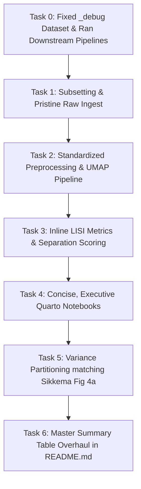

# Plan: Dataset Onboarding Workflow Overhaul & Debug Dataset Fix

**Date:** 2026-08-20  
**Status:** COMPLETED  
**Scope:** `notebooks/dataset_onboarding/`, `src/2_dataset_specific_preprocessing/1.3.1_prepare_joanito.R`, `src/3_scrnaseq_preprocessing/`, `plans/`

---

## 1. Overview & Motivation

The dataset onboarding workflow in `notebooks/dataset_onboarding/` evaluates new candidate single-cell datasets to determine: **Does this dataset have a technical batch effect, or is it batch-free?**
Based on this verdict, the dataset is categorized as:
1. **Benchmark analysis** (no technical batch effect)
2. **Batch effect analysis** (defined technical batch structure)
3. **Negative control / reference**

### Core Upgrades Completed
1. **Pristine Raw Counts Ingest:** Removed reuse of author `obsm`/`obsp` to eliminate hidden batch-corrected embeddings; `locate_counts()` automatically routes raw integer counts from `adata.raw.X`.
2. **Standardized Preprocessing Pipeline:** Aligned normalization (`1e4`), log1p, HVG selection (2,000 top genes), PCA (50 PCs), and UMAP (`min_dist=0.5, spread=1.0`) with `src/3_scrnaseq_preprocessing/1.1.1_preprocess.py`.
3. **Debug Dataset Multi-Level Representation:** Fixed `1.3.1_prepare_joanito.R` to guarantee coverage across `sample.origin` (Normal, Tumor, LymphNode), `seqtec` (3' seq, 5' seq), and multi-site centers.
4. **Variance Partitioning Across Covariates:** Implemented dual-panel variance partition heatmaps matching Sikkema et al. 2023 (*Nature Medicine*, Fig. 4a), quantifying the fraction of total inter-sample variance explained by biological vs technical variables across all cell types.
5. **Clean Executive Reports:** All 10 Quarto notebooks render code-free, self-contained HTML reports with inline in-memory graphics, untruncated metadata tables, and dynamic LISI heatmaps.

---

## 2. Completed Tasks Summary

---

### Task 0 (T0): Fix `_debug` Dataset Generation & Downstream Pipelines
- Updated `select_debug_samples()` in `1.3.1_prepare_joanito.R` to strictly include multi-level coverage across `sample.origin`, `seqtec` (`"5' seq"` and `"3' seq"`), and `Site`.
- Re-generated `JoaI_2022_35773407_debug_5samples.h5ad` and verified downstream pipeline execution.

### Task 1 (T1): Subsetting & Pristine Raw Data Ingest
- `subset_by_samples()` and `create_subsets_hpc.py` discard pre-existing `obsm`/`obsp`.
- `locate_counts()` routes integer count layers directly from `raw.X` when `X` contains log-normalized floats.

### Task 2 (T2): Standardized Preprocessing & UMAP Pipeline
- Fresh unintegrated PCA and UMAP computed via `embed_and_umap_workflow()`.
- Standardized Scanpy parameters (`10k` total count normalization, `log1p`, 2000 HVGs, 50 PCs, `min_dist=0.5`).

### Task 3 (T3): Separation Metrics & In-Memory Plotting
- `plot_separation_heatmap()` updated with dynamic proportional sizing (`col_width=1.8`, `label_margin=max(4.0, ...)`), preventing text truncation.

### Task 4 (T4): Concise Quarto Notebooks Redesign
- Configured Quarto YAML (`execute: {echo: false, warning: false, message: false}`, `embed-resources: true`).
- Clean section structure: Study Summary $\to$ Count Integrity $\to$ Harmonization $\to$ Confounding Crosstab $\to$ Unintegrated UMAP $\to$ Variance Partitioning $\to$ LISI Separation.

### Task 5 (T5): Variance Partitioning across Covariates (Sikkema Fig. 4a)
- Implemented `compute_variance_partition()` and `plot_variance_partition_heatmap()` in `onboarding_utils.py`.
- Evaluates biological vs technical variance fractions across cell types and whole cohort (`Whole atlas`).

### Task 6 (T6): Centralized Master Table in `README.md`
- Master summary table in `notebooks/dataset_onboarding/README.md` tracks 17 core metadata, design, and suitability attributes.

---

## 3. Final Verification

All 10 Quarto notebooks rendered with 100% success (exit code 0):
- `dataset_check__debug.qmd`
- `dataset_check_Alzheimer.qmd`
- `dataset_check_Breast_cancer.qmd`
- `dataset_check_Covid19_PBMC.qmd`
- `dataset_check_Diabetes.qmd`
- `dataset_check_Kidney_KPMP.qmd`
- `dataset_check_Lung.qmd`
- `dataset_check_Lupus_PBMC.qmd`
- `dataset_check_Myocardial_infarction.qmd`
- `dataset_check_Parkinson.qmd`
