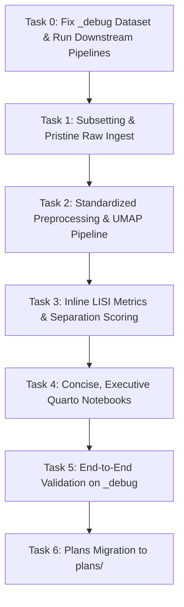

# Plan: Dataset Onboarding Workflow Overhaul & Debug Dataset Fix

**Date:** 2026-08-20  
**Status:** Ready for Review / Execution  
**Scope:** `notebooks/dataset_onboarding/`, `src/2_dataset_specific_preprocessing/1.3.1_prepare_joanito.R`, `src/3_scrnaseq_preprocessing/`, `plans/`

---

## 1. Overview & Motivation

The dataset onboarding workflow in `notebooks/dataset_onboarding/` exists to evaluate new candidate single-cell datasets and answer one specific exploratory question: **Does this dataset have a technical batch effect, or is it batch-free?**
Based on this verdict, the full dataset is later categorized as:
1. **Benchmark analysis** (no batch effect)
2. **Batch effect analysis** (defined technical batch structure)
3. **Negative control / exclude**

### Core Problems Identified
1. **Pre-existing `obsm` Reuse:** Previous helper logic checked if `X_pca` or `X_umap` existed and did not contain `"harmony"`, and reused them. Because authors often store integrated/batch-corrected embeddings under `X_pca` / `X_umap`, this masked batch effects.
2. **Parameter Discrepancies:** Onboarding embedding parameters diverged from the main `src/3_scrnaseq_preprocessing/1.1.1_preprocess.py` pipeline (e.g. ad-hoc `min_dist=0.3` instead of Scanpy defaults).
3. **Debug Dataset Batch Representation:** The 5-sample `_debug` dataset generated by `1.3.1_prepare_joanito.R` lacked multi-level representation for the `seqtec` batch column (all 5 samples had `3' seq`).
4. **Report Clutter & Intermediate Artifacts:** Quarto check notebooks (`.qmd`) dumped loose PNG files into `data/new_dataset_checks/` and printed verbose code blocks.
5. **Plans Tracking Migration:** Moving from `.kilo/plans/` to a harness-agnostic, version-controlled `plans/` directory.

---

## 2. Work Breakdown

---

### Task 0 (T0): Fix `_debug` Dataset Generation & Re-execute Downstream Pipelines

- **Target File:** `src/2_dataset_specific_preprocessing/1.3.1_prepare_joanito.R`
- **Action:**
  - Update `select_debug_samples()` to strictly require coverage across:
    - **Biological condition (`sample.origin`):** at least `Normal` and `Tumor` (and `LymphNode` if available).
    - **Batch variables (`seqtec` & `Site`):** MUST include at least one `"5' seq"` sample and at least one `"3' seq"` sample, and multiple `Site` levels.
  - Re-generate `JoaI_2022_35773407_debug_5samples.h5ad` on scratch/data.
  - Re-run `src/3_scrnaseq_preprocessing/1.1.1_preprocess.py --ds_name _debug --force`.
  - Re-run downstream pipelines (`src/4_cell_type_annotation/` and `src/5_run_benchmark_methods/`) on `_debug`.

---

### Task 1 (T1): Subsetting & Pristine Raw Data Ingest

- **Target Files:** `notebooks/dataset_onboarding/create_subsets_hpc.py`, `notebooks/dataset_onboarding/onboarding_utils.py`
- **Action:**
  - In `subset_by_samples()` and `create_subsets_hpc.py`:
    - Discard all pre-existing `adata.obsm` and `adata.obsp` (clean slate).
    - Guarantee that the saved subset (`<Name>_subset.h5ad`) strictly contains raw counts (`.X` / `.layers["counts"]`), `.obs`, and `.var`.
    - Maintain stratified sampling across biological groups and batch-candidate combinations.

---

### Task 2 (T2): Standardized Preprocessing & UMAP Pipeline

- **Target File:** `notebooks/dataset_onboarding/onboarding_utils.py`
- **Action:**
  - Remove `detect_unintegrated_obsm()`.
  - Align `compute_embed_umap()` with `src/3_scrnaseq_preprocessing/1.1.1_preprocess.py`:
    - Normalization: `sc.pp.normalize_total(target_sum=1e4)` + `sc.pp.log1p`.
    - HVG: 2,000 top genes (`flavor="seurat_v3_paper"` with count-jitter fallback).
    - Scaling & PCA: `sc.pp.scale(max_value=10)` $\rightarrow$ `sc.pp.pca(n_comps=50, svd_solver="arpack")`.
    - Neighborhood graph: `sc.pp.neighbors(n_pcs=50, n_neighbors=15)`.
    - UMAP: default Scanpy parameters (`min_dist=0.5, spread=1.0`).
  - Update `embed_and_umap_workflow()` to always execute this fresh unintegrated pipeline.

---

### Task 3 (T3): Separation Metrics & In-Memory Plotting

- **Target Files:** `notebooks/dataset_onboarding/onboarding_utils.py`, `notebooks/dataset_onboarding/onboarding_metrics.R`
- **Action:**
  - `write_metrics_input()`: ensure the PCA embedding matrix passed to `onboarding_metrics.R` is always the freshly computed unintegrated PCA.
  - Return separation metrics tables and figures directly in-memory for Quarto inline rendering (avoiding saving external PNG files to `data/new_dataset_checks/`).

---

### Task 4 (T4): Quarto Notebooks Redesign (`dataset_check_*.qmd`)

- **Target Files:** All 9 `notebooks/dataset_onboarding/dataset_check_<Name>.qmd` files and `dataset_check__debug.qmd`
- **Action:**
  - Set `execute: {echo: false, warning: false, message: false}` and `format: {html: {embed-resources: true, toc: true}}`.
  - Executive layout with 5 concise sections:
    1. **Study Summary & Metadata Overview** (expected vs actual table, candidate columns).
    2. **Raw Count Integrity Check** (integer check, nonzero counts, layer check).
    3. **Confounding Crosstab** (Bio condition $\times$ Batch variables).
    4. **Unintegrated UMAP Panels** (Scanpy grid colored by Bio, Batch, and Cell Type).
    5. **Cell-Level Separation (LISI) & Recommendation** (LISI table, heatmap, and final verdict: Benchmark vs Batch Effect vs Negative Control vs Exclude).
  - Remove all disk PNG output dumping in `data/new_dataset_checks/`.

---

### Task 5 (T5): Validation on `_debug` Dataset

- **Target Files:** `notebooks/dataset_onboarding/_debug_validation.py`
- **Action:**
  - Run `_debug_validation.py` against the newly generated `_debug` dataset.
  - Verify that:
    - `seqtec` has 2 levels (`"5' seq"` and `"3' seq"`) and `Site` has multiple levels.
    - No author `obsm` is reused.
    - UMAP and PCA match the standardized unintegrated processing.
    - Rendered HTML is self-contained and code-free.

---

### Task 6 (T6): Harness-Agnostic Plans Directory Migration

- **Action:**
  - Move `.kilo/plans/*` and `.kilo/plans/archive/*` to `plans/` and `plans/archive/`.
  - Update plan references in `AGENTS.md`, `README.md`, and `TODO.md`.
